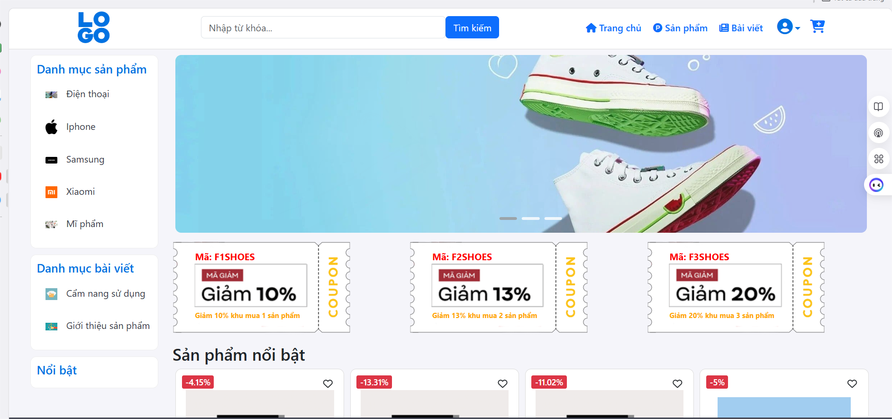
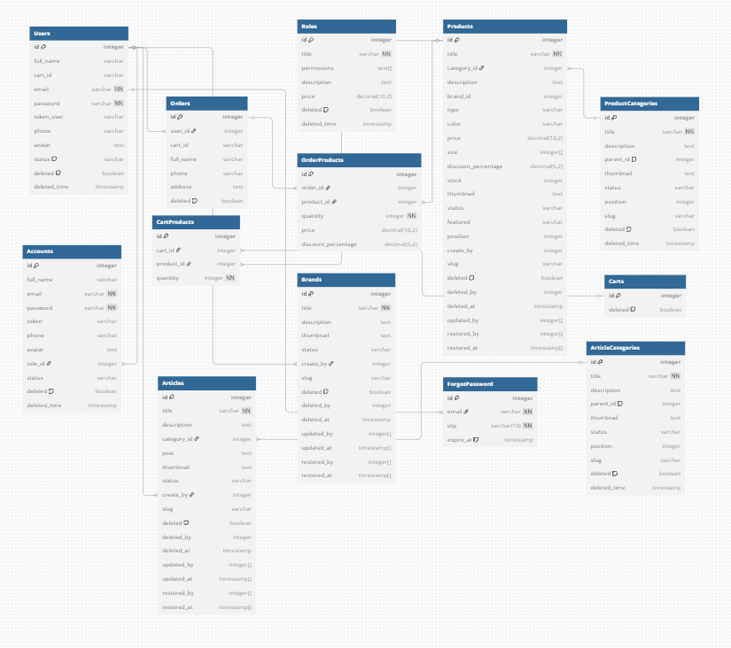

# Products Management System

## Giới thiệu

 Products Management System là một ứng dụng web dùng để quản lý thông tin sản phẩm, danh mục và bài viết. Dự án áp dụng phương pháp Server-side Rendering (SSR) và gồm hai phần chính:
 Admin: Quản trị viên có thể thêm, chỉnh sửa, xóa sản phẩm, danh mục, bài viết và quản lý quyền người dùng.
 Client: Khách hàng có thể đặt hàng, yêu cầu đặt lại mật khẩu, xác thực và đăng ký tài khoản.

## Chức năng chính
Quản lý sản phẩm, danh mục, bài viết
Phân quyền người dùng
Đặt hàng và quản lý đơn hàng
Xác thực và đăng ký tài khoản
Yêu cầu đặt lại mật khẩu

## Cài đặt và sử dụng
Yêu cầu hệ thống
Node.js v16+
MongoDB Atlas hoặc cấu hình cơ sở dữ liệu MongoDB cụ thể

## Cách chạy dự án
git clone https://github.com/ThanhBQ1415/Products-Management-System.git
cd Products-Management-System

## Cài đặt dependencies
npm install

## Cấu hình biến môi trường
Tạo file .env và thêm thông tin cần thiết:
MONGO_URI=your_mongodb_connection_string
PORT=5000
JWT_SECRET=your_jwt_secret

## Database

## Chạy server
npm start
Truy cập trang web
Mở trình duyệt và truy cập: http://localhost:3000

## Công nghệ sử dụng
Backend: Node.js, Express, MongoDB
Frontend: React, Next.js (nếu dự án dùng SSR)
Xác thực: JSON Web Token (JWT)
Triển khai: Vercel / Heroku / Railway (tuỳ theo dự án có đang deployment hay không)

